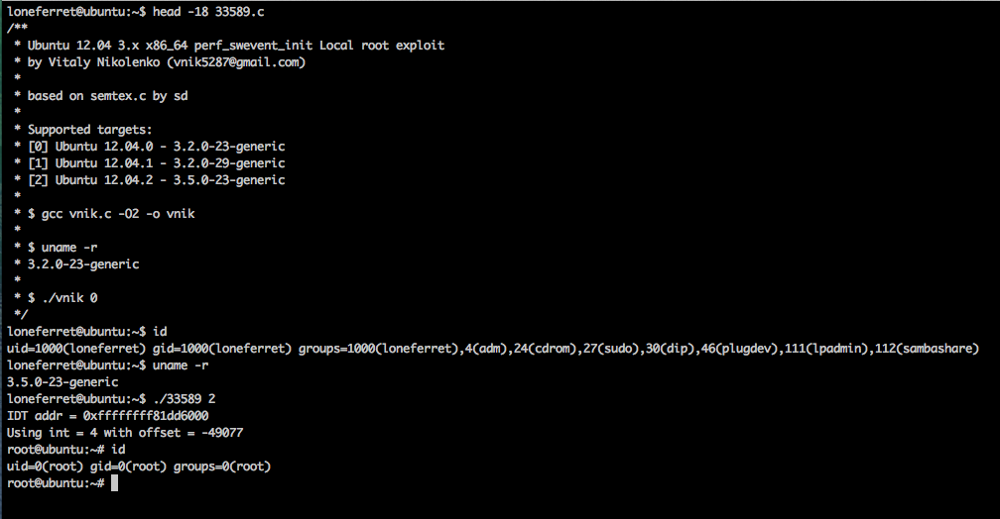

# CVE-2013-2094

CVE-2013-2094

Vulnerability reference:
 * [CVE-2013-2094](https://cve.mitre.org/cgi-bin/cvename.cgi?name=2013-2094)  

## Kernels
```
3.0.0, 3.0.1, 3.0.2, 3.0.3, 3.0.4, 3.0.5, 3.0.6, 3.1.0, 3.2, 3.3, 3.4.0, 3.4.1, 3.4.2, 3.4.3, 3.4.4, 3.4.5, 3.4.6, 3.4.8, 3.4.9, 3.5, 3.6, 3.7, 3.8.0, 3.8.1, 3.8.2, 3.8.3, 3.8.4, 3.8.5, 3.8.6, 3.8.7, 3.8.8, 3.8.9
```   

## Usage
```
$ gcc vnik.c -O2 -o vnik

$ uname -r
3.2.0-23-generic

$ ./vnik 0
```  

  

### This binary has been verified on:
 - Ubuntu 12.04.0 - Linux ubuntu 3.2.0-23-generic #36-Ubuntu x86_64  
 - Ubuntu 12.04.1 - Linux ubuntu 3.2.0-29-generic #46-Ubuntu x86_64  
 - Ubuntu 12.04.2 - Linux ubuntu 3.5.0-23-generic #35-Ubuntu x86_64   


