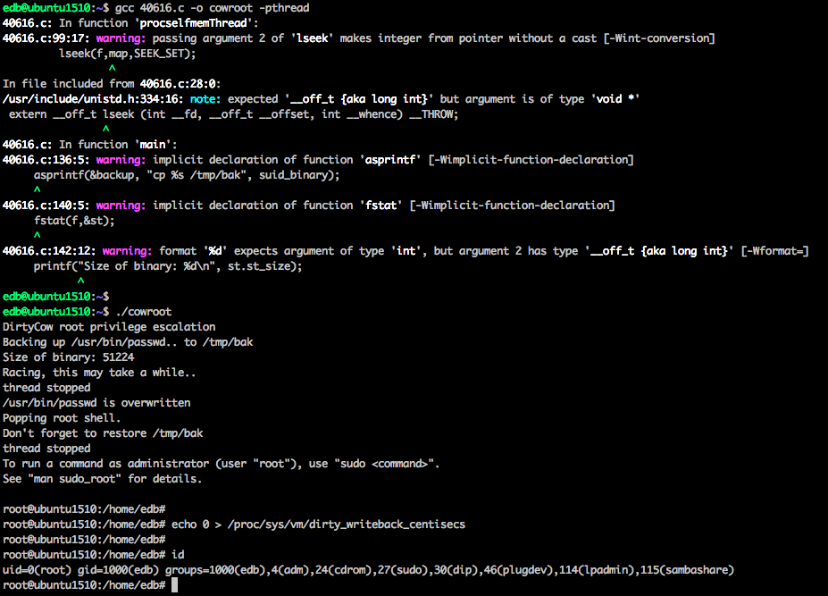

# CVE-2016-5195
```
Dirty COW

Hello

To add a new FAQ entry please send a PR for index.html.

If you wish to learn more, or share what you currently know of the vulnerability head on to the wiki (open to everyone): https://github.com/dirtycow/dirtycow.github.io/wiki

If you already know all you need to know, participate in the [challenges](https://github.com/dirtycow/dirtycow.github.io/projects) and win fame, glory and a t-shirt.

All code, images and documentation in this page and the website is in the public domain ([CC0](https://creativecommons.org/publicdomain/zero/1.0/)).

```

Vulnerability reference:
 * [CVE-2016-5195](https://cve.mitre.org/cgi-bin/cvename.cgi?name=2016-5195)  
 * [Table of PoCs](https://github.com/dirtycow/dirtycow.github.io/wiki/PoCs)  
 * [exp-db](https://www.exploit-db.com/exploits/40616/)  

## Kernels
```
Linux kernel>2.6.22 (released in 2007)
```   

## Usage
- [Explaining Dirty COW local root exploit - CVE-2016-5195](https://www.youtube.com/watch?v=kEsshExn7aE)  

```
$ gcc -pthread dirtyc0w.c -o dirtyc0w
$ ./dirtyc0w foo m00000000000000000
```  
  

## References
* [dirtycow](https://github.com/dirtycow/dirtycow.github.io)
* [CVE-2016-5195 Dirtycow: Linux内核提权漏洞分析](http://bobao.360.cn/learning/detail/3132.html)
* [CVE-2016-5195 脏牛漏洞：Linux内核通杀提权漏洞](http://m.bobao.360.cn/learning/detail/3123.html)  


