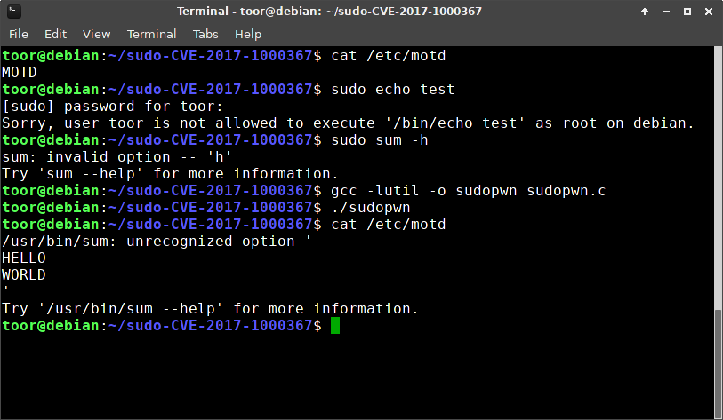

# CVE-2017-1000367  

CVE-2017-1000367  

The exp is from [@c0d3z3r0](https://github.com/c0d3z3r0/sudo-CVE-2017-1000367)  

Vulnerability reference:
 * [CVE-2017-1000367](https://people.canonical.com/~ubuntu-security/cve/2017/CVE-2017-1000367.html)  

## sudo
```
Sudo 1.8.6p7 - 1.8.20
```   

## Requirements
- System must be selinux-enabled
- sudo needs to be built with selinux support (sudo -r)
- User needs to have sudo permissions e.g. "toor ALL=(ALL) NOPASSWD: /usr/bin/sum"  

## Usage
```
- Compile: gcc -o sudopwn sudopwn.c -lutil
```  


## References
* [CVE-2017-1000367 in Sudo's get_process_ttyname() for Linux](http://www.openwall.com/lists/oss-security/2017/05/30/16)  
* [Linux security alert: Bug in sudo’s get_process_ttyname()](https://www.cyberciti.biz/security/linux-security-alert-bug-in-sudos-get_process_ttyname-cve-2017-1000367/)  


